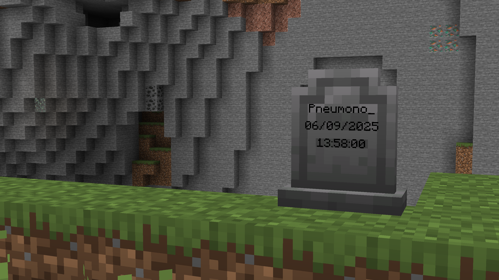
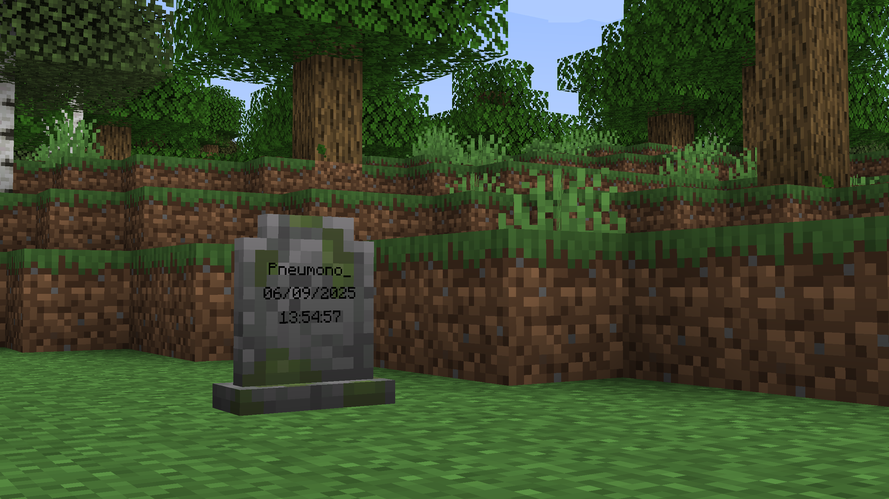

# Gravestones

Gravestones adds blocks which store your items on death.

It's a fairly standard grave mod, but with nicer, vanilla-style textures, extra config options to help tailor the mod to specific servers, and the option to use gravestones in builds.

[The wiki](https://github.com/PneumonoIsNotAvailable/Gravestones/wiki) has more detailed information, if necessary.

### Decay
Gravestone decay is very configurable and **all of its features can be configured or disabled** if they are not wanted!

By default, all gravestones decay over time and due to subsequent deaths. This is shown visually by a change in the block's texture.

After 3 stages of decay, the gravestone breaks entirely, spilling its contents onto the ground (after which the vanilla 5-minute despawn timer applies).

### Aesthetic Gravestones
Gravestones also includes craftable "aesthetic gravestones", which allow builders to use the gravestone blocks without having their builds at risk of damage.
They can also be written on and dyed just like signs.

### Configs
This is a short summary of some of the mod's configs. For the full list with more detailed explanations, see [the wiki](https://github.com/PneumonoIsNotAvailable/Gravestones/wiki/Configs).
- Whether gravestones decay due to subsequent deaths
- Whether gravestones decay over time, and how long it takes
- Whether gravestones store experience, how much they store, and whether experience "decays" over time along with the gravestone itself
- Whether gravestones can be accessed by players other than their owner
- What time format the gravestones display (client-side)
- And more!

### Compatibility
At the time of writing, Gravestones has built-in support for Trinkets, several Soulbound enchantment mods, and Spelunkery's recovery compass changes. More mods will be added in the future.

If another mod adds an item or enchantment with some kind of functionality on death that gravestones is affecting (e.g. an item that stays with the player on death, or something like Curse of Vanishing),
datapack/modpack/mod developers can add it to the tag `gravestones:skips_gravestones`, which makes items ignore gravestones entirely, and act as if the mod is not installed.

Mod developers can also add more complex conditions for gravestone skipping, if necessary.
Mods that add custom slots, or some other data that is dropped on death, can easily support for Gravestones by registering a gravestone data type.
A more detailed explanation of this can be found [here](https://github.com/PneumonoIsNotAvailable/Gravestones/wiki/Compatibility).

### Translations
At the time of writing, Gravestones currently only has full translations for English. Slightly outdated translations for simplified and traditional Chinese are available.

If you're able to translate Gravestones into a different language, please create a pull request and do so!
Create a copy of the `en_us.json` file in the mod's asset folder, and rename it to the appropriate locale code (viewable on the [Minecraft Wiki](https://minecraft.wiki/w/Language)).
Then simply go through all the English phrases and translate them.

### Dependencies
Gravestones depends on my core mod, [PneumonoCore](https://modrinth.com/mod/pneumono_core), however this is included in the mod and does not need to be downloaded separately.